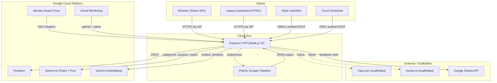
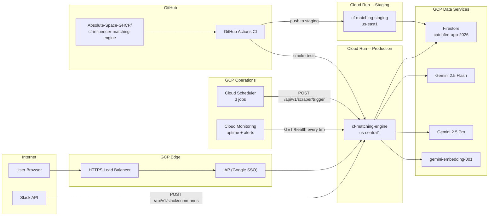
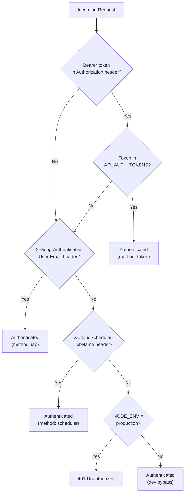
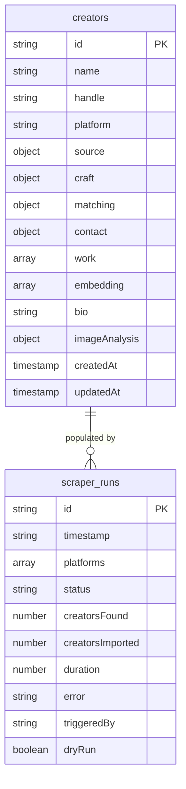
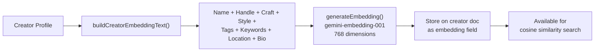
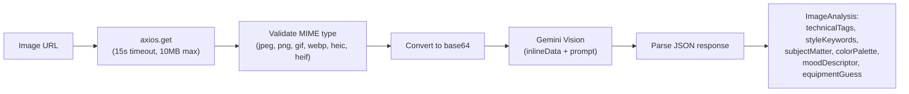
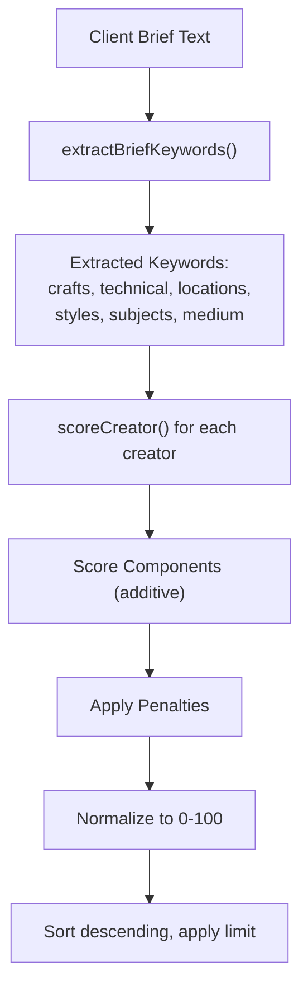
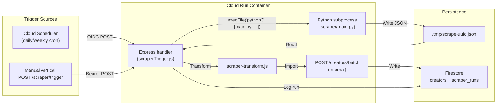
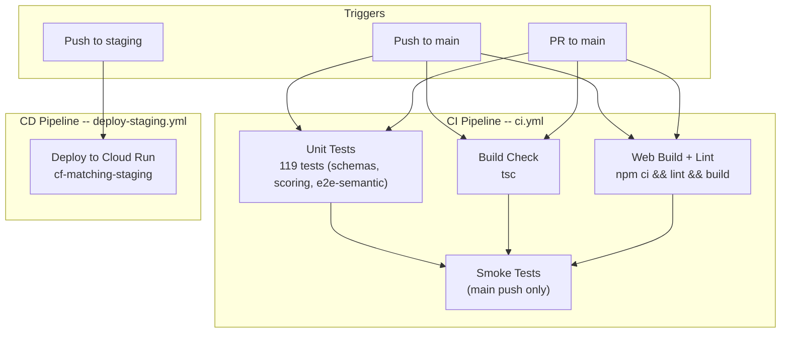

# CatchFire Matching Engine -- Architecture

> **Living document.** This file is the single source of truth for the system's architecture, services, data flows, and configuration. Update it when components are added, changed, or retired.

**Version:** 0.8.0  
**Last Updated:** 2026-03-05

---

## Table of Contents

1. [System Overview](#1-system-overview)
2. [Service Topology](#2-service-topology)
3. [API Layer](#3-api-layer)
4. [Authentication and Authorization](#4-authentication-and-authorization)
5. [Data Layer (Firestore)](#5-data-layer-firestore)
6. [AI/LLM Integration](#6-aillm-integration)
7. [Scoring Algorithm](#7-scoring-algorithm)
8. [Scraper Pipeline](#8-scraper-pipeline)
9. [Frontend Architecture](#9-frontend-architecture)
10. [CI/CD Pipeline](#10-cicd-pipeline)
11. [Monitoring and Observability](#11-monitoring-and-observability)
12. [Environment Configuration](#12-environment-configuration)
13. [Infrastructure Dependencies](#13-infrastructure-dependencies)
14. [Component Status Flags](#14-component-status-flags)
15. [Future Enhancements](#15-future-enhancements)

---

## 1. System Overview

### Mission

Build a proprietary database of the world's best up-and-coming storytellers. Feed a client brief into the system and receive recommendations for creators matched on **craft, style, and location** -- not audience size. Craft over clout.

### High-Level Architecture



### Runtime Stack

| Layer | Technology | Version |
|-------|-----------|---------|
| Runtime | Node.js | 22 LTS |
| Framework | Express | 5.1 |
| Language | TypeScript + JavaScript (CommonJS) | TS 5.9 |
| Validation | Zod | 4.3 |
| Database | Google Cloud Firestore | SDK 8.3 |
| AI/LLM | Google Gemini via `@google/genai` | SDK 1.41 |
| Frontend | React + Vite | React 19, Vite 7 |
| Scraper | Python 3 | requests + beautifulsoup4 |
| Container | Docker (multi-stage) | node:22-slim base |
| Hosting | Google Cloud Run | us-central1 (prod), us-east1 (staging) |

---

## 2. Service Topology



### Service Inventory

| Service | Type | Region | URL | Status |
|---------|------|--------|-----|--------|
| `cf-matching-engine` | Cloud Run | us-central1 | `https://cf-matching-engine-34240596768.us-central1.run.app` | **Live** |
| `cf-matching-staging` | Cloud Run | us-east1 | `https://cf-matching-staging-34240596768.us-east1.run.app` | **Live** |
| IAP (production) | Identity-Aware Proxy | -- | `https://cf-matching-engine.34.54.144.178.nip.io` | **Live** |
| Firestore | Database | us-central1 | Console: `catchfire-app-2026` | **Live** |
| Cloud Scheduler | Cron | us-central1 | 3 jobs (daily vimeo, daily behance, weekly all) | **Live** |
| Cloud Monitoring | Observability | global | Uptime check + 2 alert policies | **Live** |
| GitHub Actions CI | CI/CD | -- | On push/PR to `main` | **Live** |
| GitHub Actions Staging | CD | -- | On push to `staging` branch | **Live** |

---

## 3. API Layer

### Express Server (`src/index.js`)

The API is a single Express 5 application serving both REST endpoints and static frontend assets from the same Cloud Run container.

### Global Middleware Stack

Applied to every request in this order:

1. **`helmet`** -- Security headers with custom CSP (inline scripts for legacy dashboard, Google Fonts)
2. **`cors`** -- Configurable origin (`CORS_ORIGIN` env var), supports credentials
3. **`express-rate-limit`** -- 100 requests per 15-minute window (configurable via env vars)
4. **`express.json`** -- JSON body parsing, 10MB limit
5. **`express.static`** -- Serves `public/` directory at root

### Endpoint Inventory

#### Core CRUD

| Method | Path | Auth | Description |
|--------|------|------|-------------|
| GET | `/api/v1/creators` | optional | List/search creators with query filters (craft, location, platform, tags, subjectMatter, budgetTier, limit) |
| GET | `/api/v1/creators/:id` | optional | Get single creator. Supports `?includeWork=true&includeSource=true` |
| POST | `/api/v1/creators` | required | Create a single creator (Zod-validated) |
| PATCH | `/api/v1/creators/:id` | required | Partial update of creator fields |
| POST | `/api/v1/creators/batch` | none | Bulk import (used internally by scraper pipeline) |
| POST | `/api/v1/import/apify` | required | Import from Apify scraper output format |

#### AI / Intelligence

| Method | Path | Auth | Description |
|--------|------|------|-------------|
| POST | `/api/v1/match` | none | Match creators to a brief using scoring algorithm. Accepts `filters`, `includeWorkLinks`, `includeSourceLinks` |
| POST | `/api/v1/categorize` | required | LLM-categorize a creator bio into craft, tags, style signature |
| POST | `/api/v1/style-signature` | required | Generate a style signature for a creator |
| POST | `/api/v1/analyze-image` | required | Preview Gemini Vision analysis of a portfolio image URL |
| POST | `/api/v1/creators/:id/analyze-image` | required | Analyze image and merge results into creator profile |

#### Embeddings and Semantic Search

| Method | Path | Auth | Description |
|--------|------|------|-------------|
| POST | `/api/v1/embeddings/generate/:id` | required | Generate 768-dim embedding for a single creator |
| POST | `/api/v1/embeddings/batch` | required | Batch-generate embeddings for all creators without one |
| GET | `/api/v1/similar/:id` | optional | Find creators similar to a given creator (cosine similarity) |
| POST | `/api/v1/search/semantic` | none | Semantic search with text query and optional structured `filters` (AND logic) |

#### Golden Record Lookalikes

| Method | Path | Auth | Description |
|--------|------|------|-------------|
| GET | `/api/v1/lookalikes` | optional | Find creators most similar to the Golden Record centroid |
| GET | `/api/v1/lookalikes/model` | optional | Get current Golden Record model info (centroid, count, IDs) |
| GET | `/api/v1/lookalikes/score/:id` | optional | Score a single creator against the Golden Record model |
| POST | `/api/v1/lookalikes/refresh` | required | Rebuild the Golden Record centroid from current data |

#### Scraper (mounted via `src/routes/scraperTrigger.js`)

| Method | Path | Auth | Description |
|--------|------|------|-------------|
| POST | `/api/v1/scraper/trigger` | scraper | Trigger a scrape run. Accepts `{ platforms, limit, dryRun }` |
| GET | `/api/v1/scraper/status` | scraper | Last run info + total run count |
| GET | `/api/v1/scraper/reports` | scraper | Last 10 scraper run reports |

Scraper auth accepts either `X-CloudScheduler-JobName` header (Cloud Scheduler OIDC) or `Authorization: Bearer <SCRAPER_API_KEY>`.

#### Slack (mounted via `src/routes/slack.js`)

| Method | Path | Auth | Description |
|--------|------|------|-------------|
| GET | `/api/v1/slack/health` | none | Health check for Slack URL verification |
| POST | `/api/v1/slack/commands` | HMAC | Slash command handler (`/catchfire find <query>`) |

#### Contact Enrichment (mounted via `src/routes/enrichment.js`)

| Method | Path | Auth | Description |
|--------|------|------|-------------|
| GET | `/api/v1/enrichment/status` | required | Shows provider config status (which env vars are set) |
| POST | `/api/v1/enrichment/enrich/:id` | required | Enrich a single creator's contact info |
| POST | `/api/v1/enrichment/bulk` | required | Bulk enrichment |

> **Status: Scaffolded.** Returns `awaiting_configuration` until `CLAY_API_KEY` or `HUNTER_API_KEY` is set. Awaiting budget approval.

#### System

| Method | Path | Auth | Description |
|--------|------|------|-------------|
| GET | `/health` | none | Health check (status, version, config) |
| GET | `/api/v1/stats` | optional | Database statistics (total creators, by craft, by platform) |
| GET | `/api/v1/auth/me` | none | Returns current auth state (IAP email, token presence, or unauthenticated) |
| GET | `/api/v1/llm/test` | optional | Test Gemini LLM connection, returns model routes |
| GET | `/api/v1/embeddings/test` | optional | Test embedding generation |
| POST | `/api/v1/feedback` | required | Submit match feedback (thumbs up/down) to Google Sheets |

#### HTML/SPA Serving

| Method | Path | Description |
|--------|------|-------------|
| GET | `/` | Root landing page (`public/index.html`) |
| GET | `/dashboard` | Legacy monitoring dashboard (`public/dashboard.html`) |
| GET | `/testing` | Legacy match + feedback testing UI (`public/testing.html`) |
| GET | `/app/*` | React SPA (serves `web/dist/index.html` for all sub-routes) |

### Route Module Files

| File | Mount Point | Purpose |
|------|-------------|---------|
| `src/routes/scraperTrigger.js` | `/api/v1/scraper` | Cloud Scheduler trigger, run history |
| `src/routes/slack.js` | `/api/v1/slack` | Slack slash command handling |
| `src/routes/enrichment.js` | `/api/v1/enrichment` | Contact enrichment scaffold |

---

## 4. Authentication and Authorization

The system supports four distinct authentication methods depending on the caller.



### Method 1: Identity-Aware Proxy (IAP)

- **Used by:** Browser users accessing production via the IAP-secured URL
- **Flow:** User hits `https://cf-matching-engine.34.54.144.178.nip.io` -> Google SSO login -> IAP injects `X-Goog-Authenticated-User-Email` and `X-Goog-Authenticated-User-Id` headers -> Express reads headers
- **Header format:** `accounts.google.com:user@domain.com` (prefix stripped by middleware)
- **Files:** `src/middleware/auth.js`, `src/middleware/optionalAuth.js`

### Method 2: Bearer Token

- **Used by:** API clients, the React SPA (stored in `localStorage`), admin tools
- **Flow:** Client sends `Authorization: Bearer <token>` -> middleware checks against comma-separated `API_AUTH_TOKENS` env var
- **Token storage (frontend):** `localStorage` key `cf-auth-token`
- **Session cache:** `sessionStorage` key `cf-auth-check` (5-minute TTL for ProtectedRoute)

### Method 3: Cloud Scheduler (OIDC)

- **Used by:** Cloud Scheduler scraper jobs
- **Flow:** Scheduler sends OIDC token + `X-CloudScheduler-JobName` header -> `authenticateScraperRequest` middleware validates
- **Service account:** `scheduler-invoker@catchfire-app-2026.iam.gserviceaccount.com`

### Method 4: Slack HMAC

- **Used by:** Slack slash command requests
- **Flow:** Slack POST with `X-Slack-Signature` and `X-Slack-Request-Timestamp` -> compute `HMAC-SHA256(v0:timestamp:rawBody)` with `SLACK_SIGNING_SECRET` -> `crypto.timingSafeEqual` comparison
- **Replay protection:** Requests older than 5 minutes are rejected
- **Dev mode:** If `SLACK_SIGNING_SECRET` is unset, verification is skipped

### Middleware Variants

| Middleware | Behavior on Failure | Used On |
|------------|-------------------|---------|
| `requireAuth` | Returns 401 | Mutation endpoints (POST/PATCH), admin actions |
| `optionalAuth` | Continues unauthenticated | Read endpoints (GET), stats, test |
| `authenticateScraperRequest` | Returns 401 | All `/api/v1/scraper/*` routes |

---

## 5. Data Layer (Firestore)

### Collections



| Collection | Document Count | Purpose | Env Override |
|------------|---------------|---------|--------------|
| `creators` | Variable (production data) | Creator profiles with embeddings | `FIRESTORE_COLLECTION` |
| `creators-staging` | Variable (staging data) | Isolated staging data | `FIRESTORE_COLLECTION=creators-staging` |
| `scraper_runs` | Append-only log | Scraper execution history | Hardcoded |

### Creator Document Schema

The full schema is defined in `src/schemas.ts` using Zod. Key fields:

```
{
  id: string                          // Firestore auto-ID
  name: string                        // "Alex Chen"
  handle: string                      // "@alexchen_dp"
  platform: enum                      // vimeo | behance | artstation | instagram | ...
  
  source: {
    type: enum                        // festival | platform | community | referral | manual
    name: string                      // "Camerimage"
    url: string                       // Discovery URL
    discoveredAt: timestamp
  }
  
  craft: {
    primary: enum                     // cinematographer | director | editor | colorist | ...
    secondary: string[]               // ["colorist", "editor"]
    styleSignature: string            // LLM-generated style description
    technicalTags: string[]           // ["#ArriAlexa", "#Anamorphic"]
    subjectMatterTags: string[]       // food, automotive, fashion, sports, ...
    subjectSubcategoryTags: string[]  // restaurant, luxury-automotive, ...
    primaryMedium: enum               // still | video | audio
    classification: string            // photography, documentary, music_video, ...
  }
  
  matching: {
    positiveKeywords: string[]
    negativeKeywords: string[]
    qualityScore: number              // 0-100
    isGoldenRecord: boolean
    lastVerified: timestamp
  }
  
  contact: {
    email: string
    portfolio_url: string
    location: string
    locationConstraints: enum         // digital_only | on_site | flexible
    rateRange: string
    budgetTier: enum                  // emerging | mid-tier | established
    isHireable: boolean
  }
  
  work: [{                            // Portfolio pieces / festival entries
    title: string
    url: string
    type: enum                        // portfolio | reel | project | festival_entry | award | article | interview
    description?: string
    year?: number
  }]
  
  embedding: number[768]              // Gemini embedding vector (inline)
  bio: string
  imageAnalysis: { ... }              // Gemini Vision results (when analyzed)
  lastActiveDate: string              // ISO date
  createdAt: timestamp
  updatedAt: timestamp
}
```

### Craft Types (14)

`cinematographer`, `director`, `editor`, `colorist`, `vfx_artist`, `compositor`, `motion_designer`, `3d_artist`, `animator`, `sound_designer`, `producer`, `gaffer`, `photographer`, `other`

### Caching

The Express server maintains an in-memory creator cache with a 5-minute TTL. All read endpoints hit the cache first. Write operations (`POST`, `PATCH`) invalidate the cache.

---

## 6. AI/LLM Integration

### SDK and Auth

- **Package:** `@google/genai` v1.41 (unified SDK for Google AI and Vertex AI)
- **Auth priority:** `GEMINI_API_KEY` or `GOOGLE_API_KEY` env var -> Google AI API. If neither is set, falls back to Vertex AI with Application Default Credentials (ADC).
- **Project:** `catchfire-app-2026`, Region: `us-central1`

> **Note:** The deprecated `@google-cloud/vertexai` package was removed in January 2026. Do not re-add it.

### Model Routing

The system routes requests to different models based on task complexity:

| Task | Model | Env Override | Rationale |
|------|-------|-------------|-----------|
| Brief analysis | `gemini-2.5-pro` | `GEMINI_MODEL_PRO` | Complex reasoning over multi-faceted client briefs |
| Categorization | `gemini-2.5-flash` | `GEMINI_MODEL` | Fast structured extraction from bios |
| Style signature | `gemini-2.5-flash` | `GEMINI_MODEL` | Creative writing, speed over depth |
| Image analysis (vision) | `gemini-2.5-flash` | `GEMINI_MODEL` | Multimodal, fast turnaround |
| Semantic search | `gemini-2.5-flash` | `GEMINI_MODEL` | Latency-sensitive |
| Embeddings | `gemini-embedding-001` | Hardcoded | 768-dimension vectors |

### LLM Functions (`src/llm.ts`)

| Function | Input | Output | Used By |
|----------|-------|--------|---------|
| `categorizeCreator(bio, portfolioUrl?, recentWork?)` | Creator bio text | `CategorizationResult` (craft, tags, style, keywords) | `POST /api/v1/categorize` |
| `generateStyleSignature(name, craft, bio, tags)` | Creator profile fields | Style description string | `POST /api/v1/style-signature` |
| `analyzeBrief(brief)` | Client brief text | `BriefAnalysis` (crafts needed, requirements, urgency) | `POST /api/v1/match` |
| `analyzePortfolioImage(imageUrl)` | Image URL | `ImageAnalysis` (tags, style, subject, palette, mood, equipment) | `POST /api/v1/analyze-image` |
| `generateEmbedding(text, taskType)` | Text + task type | 768-dim vector | Embedding generation |
| `generateEmbeddings(texts, taskType)` | Batch texts | Array of 768-dim vectors | Batch embedding |
| `buildCreatorEmbeddingText(creator)` | Creator object | Concatenated text for embedding | Pre-embedding |
| `findSimilar(queryEmb, candidates, opts)` | Query vector + candidate vectors | Ranked similar items | Semantic search, similar creators |
| `buildGoldenRecordModel(goldenRecords)` | Array of Golden Record embeddings | Centroid model | Lookalike model |
| `findLookalikes(model, candidates, opts)` | Model + candidate embeddings | Ranked lookalikes | `GET /api/v1/lookalikes` |
| `testLLMConnection()` | -- | boolean | `GET /api/v1/llm/test` |
| `testEmbeddings()` | -- | `{ success, dimensions }` | `GET /api/v1/embeddings/test` |

### Embedding Pipeline



### Image Analysis Pipeline



---

## 7. Scoring Algorithm

Defined in `src/scoring.ts`. The algorithm ranks creators against a client brief using a weighted multi-factor scoring system.

### Scoring Pipeline



### Score Components

| Component | Points | Condition |
|-----------|--------|-----------|
| Exact name/handle match | 100 | Brief contains creator's name or handle |
| Primary craft match | 30 | Creator's primary craft mentioned in brief |
| Secondary craft match | 15 | Any secondary craft mentioned |
| Location match | 20 | Creator's location mentioned in brief |
| Technical tag match | 10 each | Per matching `#tag` (e.g. `#ArriAlexa`) |
| Positive keyword match | 5 each | Per matching professional indicator |
| Golden Record bonus | 15 | Creator is marked as a Golden Record |
| Quality score | 0.2x | Scales with the creator's 0-100 quality score |
| Style match | up to 15 | Keyword overlap between brief style terms and creator's style signature |
| Subject matter match | 12 | Subject tag overlap (food, automotive, fashion, etc.) |
| Subject subcategory match | 8 | Narrower subcategory overlap |
| Primary medium match | 10 | Brief implies still/video/audio and creator matches |

### Penalties

| Penalty | Points | Condition |
|---------|--------|-----------|
| Negative keyword match | -20 each | Creator has negative keywords that appear in brief context |
| Influencer noise detection | -10 each | Creator profile contains noise terms (`#fyp`, `#viral`, `vlogger`, etc.) |

### Bonuses

| Bonus | Points | Condition |
|-------|--------|-----------|
| Craft positive indicators | +5 each (max +20) | Creator profile mentions awards, festivals, certifications, high-end productions |

### Influencer Noise Keywords (anti-pattern filter)

`fyp`, `foryoupage`, `viral`, `trending`, `grwm`, `ootd`, `influencer`, `content creator`, `lifestyle`, `vlog`, `vlogger`, `subscribe`, `like and subscribe`, `brand deal`, `sponsored`, `pr package`, `haul`, `unboxing`, `asmr`, `mukbang`, `canonm50`, `iphone cinematography`, `phone footage`

### Craft Positive Indicators

`award`, `winner`, `nominee`, `festival`, `camerimage`, `sundance`, `annecy`, `ciclope`, `cannes`, `golden frog`, `staff pick`, `commercial director`, `cinematographer`, `vfx supervisor`, `lead compositor`, `senior colorist`, `showrunner`, `feature film`, `theatrical`, `broadcast`, `netflix`, `hbo`, `arri certified`, `red certified`, `davinci certified`

---

## 8. Scraper Pipeline

### Architecture



### Pipeline Steps

1. **Trigger:** Cloud Scheduler or manual API call hits `POST /api/v1/scraper/trigger` with `{ platforms, limit, dryRun }`
2. **Subprocess:** Express spawns `python3 scraper/main.py` with platform and limit arguments
3. **Scrape:** Python pipeline (`pipeline.py`) orchestrates: scrape -> quality filter (min 1 award or 3 tags) -> deduplication (name/URL) -> export JSON
4. **Output:** JSON file at `/tmp/scrape-{uuid}.json` with `{ records, metadata }`
5. **Transform:** `scraper-transform.js` converts Python output to `BatchCreatorSchema` format
6. **Import:** Internal POST to `/api/v1/creators/batch` writes to Firestore
7. **Log:** Run metadata written to `scraper_runs` collection

### Configured Sources (14)

#### Festivals (9)

| Source | Key | Priority | Cadence | Notes |
|--------|-----|----------|---------|-------|
| Camerimage | `camerimage` | HIGH | Annual | Cinematography. Golden Frog = top honor. |
| Annecy | `annecy` | HIGH | Annual | Animation authority. Cristal = top prize. |
| Ars Electronica | `ars_electronica` | MEDIUM_HIGH | Annual | Creative tech, interactive art, AI art. |
| SXSW Title Design | `sxsw_title` | HIGH | Annual | Title sequences. Credits list individual roles. |
| Ciclope Festival | `ciclope` | VERY_HIGH | Annual | **Gold source.** Separates by craft role. |
| UKMVA | `ukmva` | HIGH | Annual | Music video craft. |
| Promax Awards | `promax` | MEDIUM | Annual | Broadcast design, motion graphics. |
| Sitges Film Festival | `sitges` | MEDIUM | Annual | Fantasy/horror. Practical effects. |
| Fantastic Fest | `fantastic_fest` | MEDIUM | Annual | Practical effects, genre cinema. |

#### Platforms (5)

| Source | Key | Priority | Cadence | Notes |
|--------|-----|----------|---------|-------|
| The Rookies | `the_rookies` | VERY_HIGH | Quarterly | Emerging VFX, game dev, 3D talent. |
| ShotDeck | `shotdeck` | LOW_MEDIUM | Quarterly | Reference shots -> trace credits to find DPs. Requires subscription. |
| Director's Notes | `directors_notes` | MEDIUM | Quarterly | Interviews with style language. |
| Motionographer | `motionographer` | VERY_HIGH | Monthly | Motion design industry standard. |
| Stash Media | `stash_media` | MEDIUM | Quarterly | Motion design and VFX archive. Requires subscription. |

### Python Dependencies

- `requests>=2.28.0`
- `beautifulsoup4>=4.12.0`

### Scraper Auth

| Method | Header/Field | Used By |
|--------|-------------|---------|
| Cloud Scheduler OIDC | `X-CloudScheduler-JobName` | Automated cron jobs |
| Bearer token | `Authorization: Bearer <SCRAPER_API_KEY>` | Manual/API triggers |

---

## 9. Frontend Architecture

The application serves two frontend systems from the same container.

### React SPA (`web/`)

**Stack:** React 19.2, React Router 7.13, Vite 7.3, TypeScript 5.9

**Served at:** `/app/*` (all sub-routes fall back to `web/dist/index.html`)

| Route | Component | Protected | Description |
|-------|-----------|-----------|-------------|
| `/app/` | Redirect | No | Redirects to `/app/creators` |
| `/app/creators` | CreatorBrowse | No | Browse/search creators with filters |
| `/app/creators/:id` | CreatorProfile | No | Creator detail view |
| `/app/how-it-works` | HowItWorks | No | Explainer page |
| `/app/login` | Login | No | Token entry + IAP auto-detect |
| `/app/admin` | Admin | **Yes** | Refresh lookalike model, admin actions |
| `/app/status` | Status | No | Health check dashboard (4 sections) |
| `/app/scraper` | ScraperDashboard | **Yes** | Scraper run history and manual trigger |

**Route guards:** `ProtectedRoute` component checks `GET /api/v1/auth/me`, caches result in `sessionStorage` for 5 minutes, redirects to `/app/login` if unauthenticated.

**API client:** `web/src/api/client.ts` -- reads token from `localStorage('cf-auth-token')`, sends as `Authorization: Bearer <token>`. Falls back to no auth for public endpoints.

### Legacy Dashboard (`public/`)

| File | URL | Description |
|------|-----|-------------|
| `index.html` | `/` | Root landing with semantic search, hint chips (multi-select with AND-logic filters), brief templates |
| `dashboard.html` | `/dashboard` | Monitoring dashboard with service status cards |
| `testing.html` | `/testing` | Match testing UI with feedback (thumbs up/down) |
| `analytics.html` | `/analytics` | Analytics view |

### Hint Chips (Multi-Select AND Logic)

The root landing page supports two types of hint chips that can be combined:

- **Query chips** (solid border): Set the semantic search query (e.g. "Moody DP", "VFX Artist"). Multiple can be active; queries are concatenated.
- **Filter chips** (dashed border): Apply structured filters (subject matter: Food, Automotive, Fashion, Sports; location: LA, NYC). Multiple can be active with AND logic.

When both are active, the search combines the text query (for embedding) with structured filters (for pre-filtering).

---

## 10. CI/CD Pipeline



### CI Workflow (`ci.yml`)

| Job | Runs On | Depends On | Trigger |
|-----|---------|-----------|---------|
| `unit-tests` | ubuntu-latest | -- | Push/PR to main |
| `build` | ubuntu-latest | -- | Push/PR to main |
| `web-build` | ubuntu-latest | -- | Push/PR to main |
| `smoke-tests` | ubuntu-latest | unit-tests, build, web-build | Push to main only |

### Staging Deployment (`deploy-staging.yml`)

- **Trigger:** Push to `staging` branch
- **Action:** `gcloud run deploy cf-matching-staging --source . --region us-east1 --no-allow-unauthenticated`
- **Env vars:** `NODE_ENV=staging`, `FIRESTORE_COLLECTION=creators-staging`

### Docker Build

Multi-stage Dockerfile (`Dockerfile`):

1. **Stage 1 (frontend-build):** `node:22-slim`, installs web deps, runs `npm run build` in `web/`
2. **Stage 2 (runtime):** `node:22-slim` + Python 3, installs backend deps, compiles TypeScript, copies public assets, installs Python scraper deps, copies built React app from stage 1
3. **Entry:** `CMD ["node", "src/index.js"]`, `PORT=8080`, `NODE_ENV=production`

---

## 11. Monitoring and Observability

### Cloud Monitoring

| Resource | Config File | Description |
|----------|-------------|-------------|
| Uptime check | `scripts/monitoring/uptime-check.json` | `GET /health` every 5 minutes against production |
| Error rate alert | `scripts/monitoring/error-rate-alert.json` | Alert when 5xx errors exceed 5 in a 5-minute window |
| Latency alert | `scripts/monitoring/latency-alert.json` | Alert when p99 latency exceeds 10 seconds |

**Notification channel:** CatchFire Engineering email (`projects/catchfire-app-2026/notificationChannels/14498102877036729188`)

### Health Endpoint

`GET /health` returns:

```json
{
  "status": "ok",
  "app": "CatchFire Matching Engine",
  "version": "0.8.0",
  "timestamp": "2026-03-05T12:00:00.000Z",
  "config": {
    "projectId": "catchfire-app-2026",
    "region": "us-central1",
    "model": "gemini-2.5-flash",
    "collection": "creators"
  }
}
```

### Status Dashboard (`/app/status`)

The React Status page runs 6 independent health checks:

| Section | Checks | Endpoints Called |
|---------|--------|----------------|
| Core Services | Cloud Run (Express), Firestore | `GET /health`, `GET /api/v1/stats` |
| AI Services | Gemini LLM, Embeddings | `GET /api/v1/llm/test`, `GET /api/v1/embeddings/test` |
| Data Pipeline | Scraper status | `GET /api/v1/scraper/status` |
| Authentication | Current auth state | `GET /api/v1/auth/me` |

Each check displays a status dot (green/red/gray), response time in ms, and relevant metadata.

### Application Logging

All log messages use emoji prefixes for quick visual scanning:

| Prefix | Meaning |
|--------|---------|
| `📥` | Incoming request |
| `✅` | Success |
| `❌` | Error |
| `⚠️` | Warning |
| `🤖` | LLM operation |
| `🎨` | Style generation |
| `📸` | Image analysis |
| `🔢` | Embedding operation |
| `📋` | Brief analysis |
| `🎯` | Match operation |
| `⏱️` | Timing |

---

## 12. Environment Configuration

### Full Environment Variable Reference

| Variable | Required | Default | Description | Used In |
|----------|----------|---------|-------------|---------|
| `GCP_PROJECT_ID` | Yes | `catchfire-app-2026` | Google Cloud project ID | Firestore, Vertex AI |
| `GCP_REGION` | No | `us-central1` | GCP region | Vertex AI |
| `GEMINI_MODEL` | No | `gemini-2.5-flash` | Default Gemini model (Flash) | `src/llm.ts` |
| `GEMINI_MODEL_PRO` | No | `gemini-2.5-pro` | Pro model for brief analysis | `src/llm.ts` |
| `GEMINI_API_KEY` | No | -- | Google AI API key (if set, uses API key auth) | `src/llm.ts` |
| `GOOGLE_API_KEY` | No | -- | Fallback for `GEMINI_API_KEY` | `src/llm.ts` |
| `FIRESTORE_COLLECTION` | No | `creators` | Firestore collection name | `src/index.js` |
| `PORT` | No | `8090` (local) / `8080` (Cloud Run) | HTTP port | `src/index.js` |
| `BASE_URL` | No | `http://localhost:8090` | Base URL for self-references | `src/index.js` |
| `NODE_ENV` | No | -- | `production` enables strict auth | `src/middleware/auth.js` |
| `API_AUTH_TOKENS` | No | -- | Comma-separated Bearer tokens | `src/middleware/auth.js` |
| `CORS_ORIGIN` | No | reflect origin | CORS allowed origin(s) | `src/index.js` |
| `RATE_LIMIT_WINDOW_MS` | No | `900000` (15 min) | Rate limit window | `src/index.js` |
| `RATE_LIMIT_MAX` | No | `100` | Max requests per window | `src/index.js` |
| `APP_NAME` | No | `CatchFire Matching Engine` | Display name | `src/index.js` |
| `APP_VERSION` | No | `0.8.0` | Version string | `src/index.js` |
| `ORG_NAME` | No | -- | Organization name | `src/index.js` |
| `SUPPORT_EMAIL` | No | -- | Support email | `src/index.js` |
| `SCRAPER_API_KEY` | No | -- | Bearer token for scraper routes | `src/routes/scraperTrigger.js` |
| `SLACK_SIGNING_SECRET` | No | -- | Slack app signing secret | `src/routes/slack.js` |
| `CLAY_API_KEY` | No | -- | Clay.com API key (scaffolded) | `src/routes/enrichment.js` |
| `HUNTER_API_KEY` | No | -- | Hunter.io API key (scaffolded) | `src/routes/enrichment.js` |
| `ENRICHMENT_PROVIDER` | No | -- | `clay` or `hunter` | `src/routes/enrichment.js` |
| `FEEDBACK_SHEET_ID` | No | -- | Google Sheet ID for match feedback | `src/feedback-sheet.js` |
| `FEEDBACK_TAB_NAME` | No | `Feedback` | Tab name in feedback sheet | `src/feedback-sheet.js` |
| `ENABLE_ANALYTICS` | No | `true` | Enable analytics features | `src/index.js` |
| `VITE_API_BASE` | No | -- | Frontend API base URL (Vite build-time) | `web/src/api/client.ts` |

### Staging vs Production

| Setting | Production | Staging |
|---------|-----------|---------|
| Cloud Run service | `cf-matching-engine` | `cf-matching-staging` |
| Region | `us-central1` | `us-east1` |
| `NODE_ENV` | `production` | `staging` |
| `FIRESTORE_COLLECTION` | `creators` | `creators-staging` |
| Auth | IAP + Bearer enforced | Bearer enforced |
| Public access | Blocked (403 via `--no-allow-unauthenticated`) | Blocked |

---

## 13. Infrastructure Dependencies

### Backend Dependencies (npm)

| Package | Version | Purpose | Status |
|---------|---------|---------|--------|
| `@google-cloud/firestore` | ^8.3.0 | Firestore document database | **Live** |
| `@google-cloud/storage` | ^7.19.0 | Cloud Storage SDK | **Unused** (dependency present, not referenced in code) |
| `@google/genai` | ^1.41.0 | Gemini AI (LLM, embeddings, vision) | **Live** |
| `axios` | ^1.13.0 | HTTP client (image fetching, internal calls) | **Live** |
| `cors` | ^2.8.6 | CORS middleware | **Live** |
| `dotenv` | ^17.3.1 | Environment variable loading | **Live** |
| `express` | ^5.1.0 | HTTP framework | **Live** |
| `express-rate-limit` | ^8.2.1 | Rate limiting middleware | **Live** |
| `googleapis` | ^171.4.0 | Google Sheets API (feedback) | **Live** (when `FEEDBACK_SHEET_ID` is set) |
| `helmet` | ^8.1.0 | Security headers | **Live** |
| `zod` | ^4.3.6 | Runtime schema validation | **Live** |

### Backend Dev Dependencies

| Package | Version | Purpose |
|---------|---------|---------|
| `vitest` | ^4.0.18 | Test runner (119 unit + E2E tests) |
| `typescript` | ^5.9.3 | TypeScript compiler |
| `@types/express`, `@types/cors`, `@types/node` | Various | Type definitions |
| `playwright` / `@playwright/test` | ^1.58.2 | Browser testing (available but not in CI) |
| `puppeteer` | ^24.37.5 | PDF generation (`md-to-pdf.js`) |
| `ts-node` | ^10.9.2 | TypeScript execution |
| `jspdf` | ^4.1.0 | PDF generation (legacy) |
| `md-to-pdf` | ^5.2.5 | Markdown to PDF conversion |

### Frontend Dependencies (web/)

| Package | Version | Purpose | Status |
|---------|---------|---------|--------|
| `react` | ^19.2.0 | UI library | **Live** |
| `react-dom` | ^19.2.0 | DOM rendering | **Live** |
| `react-router-dom` | ^7.13.0 | Client-side routing | **Live** |
| `vite` | ^7.3.1 | Build tool and dev server | **Live** |
| `eslint` + plugins | Various | Linting | **Live** |
| `typescript` / `typescript-eslint` | Various | Type checking | **Live** |

### Python Dependencies (scraper/)

| Package | Version | Purpose | Status |
|---------|---------|---------|--------|
| `requests` | >=2.28.0 | HTTP client for scraping | **Live** |
| `beautifulsoup4` | >=4.12.0 | HTML parsing | **Live** |

---

## 14. Component Status Flags

Every major component is tagged with one of four statuses:

| Status | Meaning |
|--------|---------|
| **Live** | Deployed and operational in production |
| **Scaffolded** | Code exists, endpoint responds, but not fully wired to external services |
| **Unused** | Dependency or code present but not referenced by any live path |
| **Planned** | Documented as a future enhancement, no code yet |

### Status Map

| Component | Status | Notes |
|-----------|--------|-------|
| Cloud Run (production) | **Live** | `cf-matching-engine`, us-central1 |
| Cloud Run (staging) | **Live** | `cf-matching-staging`, us-east1 |
| Firestore | **Live** | `creators`, `scraper_runs` collections |
| Gemini Flash (categorization, search, vision) | **Live** | Via `@google/genai` |
| Gemini Pro (brief analysis) | **Live** | Model routing in `llm.ts` |
| Gemini Embeddings (768-dim) | **Live** | `gemini-embedding-001` |
| Identity-Aware Proxy | **Live** | Google SSO for production |
| Cloud Scheduler (3 jobs) | **Live** | Daily vimeo/behance, weekly all |
| Cloud Monitoring (uptime + alerts) | **Live** | 5-min uptime, error rate, latency |
| GitHub Actions CI | **Live** | 4 jobs on push/PR to main |
| GitHub Actions staging deploy | **Live** | On push to staging branch |
| React SPA | **Live** | 7 pages, route guards |
| Legacy HTML dashboard | **Live** | 4 HTML pages at root |
| Semantic search with filters | **Live** | AND-logic structured filters |
| Multi-chip hint search | **Live** | Query chips + filter chips |
| Golden Record lookalike model | **Live** | Centroid-based similarity |
| Image analysis (Gemini Vision) | **Live** | Portfolio auto-tagging |
| Multi-model routing | **Live** | Pro for briefs, Flash for everything else |
| Work links (`includeWork/includeSource`) | **Live** | API params on match + creator endpoints |
| Python scraper pipeline | **Live** | 14 sources configured |
| Scraper transform layer | **Live** | Python JSON -> BatchCreatorSchema |
| Slack integration | **Scaffolded** | Endpoint live, needs Slack app registration |
| Contact enrichment (Clay/Hunter) | **Scaffolded** | Returns `awaiting_configuration` |
| Apify import endpoint | **Scaffolded** | `POST /api/v1/import/apify` exists, no Apify actor selected |
| Feedback to Google Sheets | **Scaffolded** | Code live, blocked on `FEEDBACK_SHEET_ID` from PM |
| `@google-cloud/storage` | **Unused** | In `package.json` but not imported anywhere |
| `sync_firestore.js` | **Unused** | Legacy ETL from employee directory sheet |
| `config.template.js` | **Unused** | Leftover from ai-agents-gmaster-build |
| Auto-categorize improvements | **Planned** | Needs feedback data loop |
| Chroma vector DB | **Planned** | Alternative to in-memory similarity search |
| Multi-region deployment | **Planned** | Currently single-region per environment |
| Custom domain (production) | **Planned** | Currently uses nip.io for IAP |

---

## 15. Future Enhancements

### Blocked / Awaiting External Input

| Enhancement | Blocked By | Owner | Action Needed |
|-------------|-----------|-------|---------------|
| Golden Records expansion | Creative team input | Dan -> Creative | Follow up on one-pager sent Feb 13 |
| Feedback sheet location | PM decision | Dan | Need `FEEDBACK_SHEET_ID` and tab name |
| External/cultural live data | Strategy confirmation | Dan | Trend API needed or scraper+LLM sufficient? |
| Apify actor selection | Budget + ToS review | Paula / Legal | Which platforms to scrape, ToS compliance |
| Charlie W demo | Scheduling | Charlie W | Review staging link, schedule demo |

### Planned Architecture Improvements

- **Chroma vector DB:** Replace in-memory cosine similarity with a dedicated vector database for better scaling. Was previously prototyped but removed due to Windows `npx` issues with the Python CLI (L011).
- **Multi-region deployment:** Staging is in `us-east1`, production in `us-central1`. Could expand to multi-region for lower latency.
- **Custom domain:** Replace `nip.io` IAP URL with a proper domain (e.g. `matching.catchfire.com`).
- **Auto-categorize feedback loop:** Once `FEEDBACK_SHEET_ID` is provided, use thumbs up/down data to fine-tune LLM categorization prompts.
- **Contact enrichment activation:** When budget is approved, activate Clay.com or Hunter.io provider in `enrichment.js` by setting env vars.
- **Slack app registration:** Register a Slack app in the CatchFire workspace, configure the `/catchfire` slash command to point at `POST /api/v1/slack/commands`.

### Tech Debt

| Item | Severity | Notes |
|------|----------|-------|
| `deploy:staging` script uses `--set-env-vars` | Low | Should be `--update-env-vars` per G003. GitHub Actions workflow is correct. |
| Legacy test files in `tests/` | Low | Old gmaster scripts (L007), harmless but cluttery |
| `web/README.md` is Vite boilerplate | Low | Should be replaced or removed |
| Integration tests need running server | Medium | 13 tests require `localhost:8090` (L016), no auto-start |
| `@google-cloud/storage` unused | Low | Can be removed from `package.json` |
| `sync_firestore.js` unused | Low | Legacy ETL, candidate for removal |
| 7 low-severity npm audit vulns | Low | Transitive, in `@google-cloud/storage` chain |

---

Author: Charley Scholz, JLAI  
Co-authored: Claude Opus 4.6, Claude Code (coding assistant), Cursor (IDE)  
Last Updated: 2026-03-05
