# CatchFire Matching Engine -- Workflows

> **Living document.** This file describes every workflow in the system end-to-end: from creator discovery through brief matching to result delivery. Each workflow is self-contained but connected to the others via the master overview.

**Version:** 0.8.0
**Last Updated:** 2026-03-05

---

## Table of Contents

1. [Master Overview](#1-master-overview)
2. [Workflow 1: Creator Discovery and Ingestion](#2-workflow-1-creator-discovery-and-ingestion)
3. [Workflow 2: Creator Enrichment and Categorization](#3-workflow-2-creator-enrichment-and-categorization)
4. [Workflow 3: Embedding Generation and Indexing](#4-workflow-3-embedding-generation-and-indexing)
5. [Workflow 4: Golden Record Model](#5-workflow-4-golden-record-model)
6. [Workflow 5: Brief Intake and Matching](#6-workflow-5-brief-intake-and-matching)
7. [Workflow 6: Result Delivery](#7-workflow-6-result-delivery)
8. [Workflow 7: Feedback Loop](#8-workflow-7-feedback-loop)
9. [Workflow 8: Admin and Operations](#9-workflow-8-admin-and-operations)
10. [Workflow 9: Deployment and CI/CD](#10-workflow-9-deployment-and-cicd)
11. [How This Fits Into CatchFire](#11-how-this-fits-into-catchfire)
12. [Workflow Status Summary](#12-workflow-status-summary)

---

## 1. Master Overview

This diagram shows every workflow in the system and how they feed into each other. Read left-to-right: creators enter the system on the left, pass through enrichment and indexing in the middle, and match against client briefs on the right.

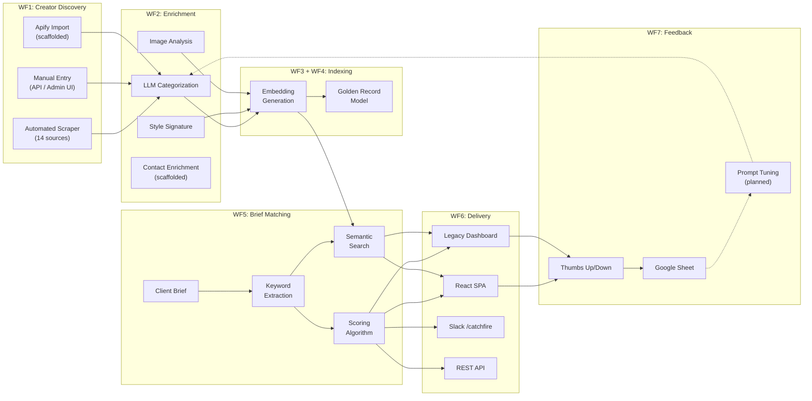

### Lifecycle Summary

| Phase | What Happens | Frequency | Owner |
|-------|-------------|-----------|-------|
| Discovery | Creators are found via scraping, manual entry, or import | Daily/weekly (automated), ad hoc (manual) | System + Creative team |
| Enrichment | LLM categorizes craft, generates style signatures, analyzes portfolio images | On ingestion + on demand | System (automated) |
| Indexing | 768-dim embeddings generated, Golden Record centroid model built | On ingestion + manual refresh | System (automated) |
| Matching | Client brief is analyzed, creators are scored and semantically ranked | On demand (per brief) | Creative team via UI/API/Slack |
| Delivery | Ranked results presented through React SPA, legacy dashboard, Slack, or API | Immediate | System |
| Feedback | Match quality ratings collected, fed back into prompt improvements | Per match result | Creative team |
| Operations | Health monitoring, scraper management, admin actions | Continuous | Engineering |

---

## 2. Workflow 1: Creator Discovery and Ingestion

This is where creators enter the system. There are three ingestion paths, all converging on the same Firestore `creators` collection.

### Flow Diagram

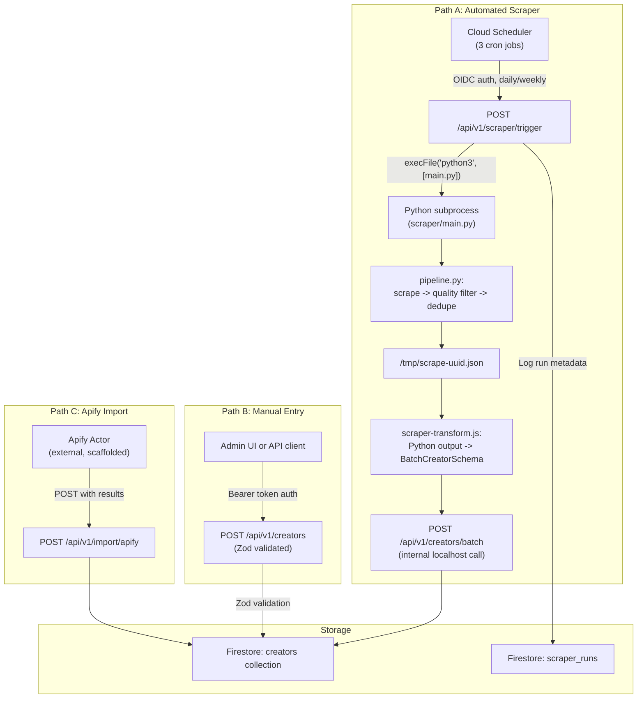

### Path A: Automated Scraper (Primary)

This is the main ingestion path. It runs on a schedule and discovers creators from 14 configured sources.

**Step-by-step:**

1. **Cloud Scheduler** fires a cron job (daily or weekly depending on the job)
2. Scheduler sends an OIDC-authenticated `POST /api/v1/scraper/trigger` with `{ platforms, limit }`
3. Express handler in `scraperTrigger.js` spawns a Python subprocess: `python3 scraper/main.py`
4. Python pipeline (`pipeline.py`) orchestrates:
   - **Scrape:** Each configured source scraper (`scrapers/`) fetches creator data from festivals, platforms, and editorial sites
   - **Quality filter:** Reject creators with fewer than 1 award/recognition OR fewer than 3 technical tags
   - **Deduplicate:** Match on name + URL to avoid duplicates
   - **Export:** Write JSON to `/tmp/scrape-{uuid}.json`
5. Express reads the JSON output file
6. `scraper-transform.js` converts Python output to the `BatchCreatorSchema` format
7. Internal `POST /api/v1/creators/batch` writes creators to Firestore
8. Run metadata (timestamp, platforms, creators found/imported, duration, errors) logged to `scraper_runs`

**Schedule:**

| Job | Schedule | Platforms | Limit |
|-----|----------|-----------|-------|
| `daily-scrape-vimeo` | 2:00 AM EST daily | vimeo | 100 |
| `daily-scrape-behance` | 3:00 AM EST daily | behance | 100 |
| `weekly-scrape-all` | Sunday 1:00 AM EST | 8 platforms | 500 |

**Scraper Sources (14):**

| Category | Sources | Priority |
|----------|---------|----------|
| Festivals (Holy Trinity) | Camerimage, Annecy, Ciclope | HIGH to VERY_HIGH |
| Festivals (Craft) | SXSW Title Design, UKMVA, Promax | HIGH to MEDIUM |
| Festivals (Genre) | Ars Electronica, Sitges, Fantastic Fest | MEDIUM to MEDIUM_HIGH |
| Platforms | The Rookies, ShotDeck, Director's Notes, Motionographer, Stash Media | LOW_MEDIUM to VERY_HIGH |

### Path B: Manual Entry

Used by the Creative team to add creators they discover through personal networks, events, or referrals.

1. User hits `POST /api/v1/creators` with a JSON body
2. Request is validated against `CreateCreatorSchema` (Zod)
3. Valid creators are written to Firestore
4. Response returns the created document with its ID

### Path C: Apify Import (Scaffolded)

Intended for bulk imports from Apify web scraping actors.

1. Apify actor runs externally (platform TBD, awaiting budget approval from Paula)
2. Actor output is POSTed to `POST /api/v1/import/apify`
3. Endpoint transforms Apify format to internal schema and writes to Firestore

> **Status:** Endpoint exists but no Apify actor is selected yet. Blocked on budget + ToS review.

---

## 3. Workflow 2: Creator Enrichment and Categorization

After a creator enters the system, they are enriched with AI-generated metadata. This can happen automatically on ingestion or on demand via API.

### Flow Diagram

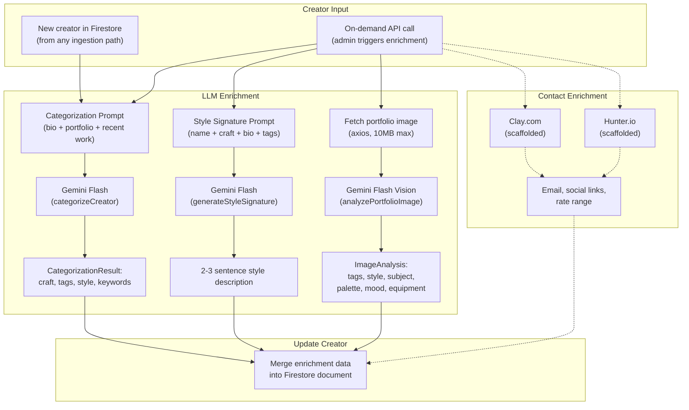

### LLM Categorization

**Endpoint:** `POST /api/v1/categorize`

**What it does:**
1. Takes a creator's bio text (and optional portfolio URL, recent work list)
2. Sends to Gemini Flash with a structured prompt
3. Returns JSON with:
   - `craft.primary` -- one of 14 craft types (e.g. `cinematographer`, `motion_designer`)
   - `craft.secondary` -- up to 3 secondary crafts
   - `craft.confidence` -- 0.0 to 1.0
   - `technicalTags` -- up to 10 hashtag-format tags (`#ArriAlexa`, `#Anamorphic`)
   - `styleSignature` -- 1-2 sentence style description
   - `positiveKeywords` -- professional indicators found in bio
   - `negativeKeywords` -- influencer/lifestyle indicators (anti-patterns)
   - `reasoning` -- why the LLM categorized them this way

**Key prompt engineering:**
- Explicitly tells the model to value **craft over clout**
- Lists all 14 valid craft types so the model uses the correct enum
- Asks for negative keywords to flag influencer noise
- Requires pure JSON output (no markdown fences)

### Style Signature Generation

**Endpoint:** `POST /api/v1/style-signature`

**What it does:**
1. Takes creator's name, craft, bio, and technical tags
2. Sends to Gemini Flash with a creative writing prompt
3. Returns a 2-3 sentence "talent agency style" description of their unique aesthetic
4. Falls back to a generic description if the LLM fails

### Image Analysis (Gemini Vision)

**Endpoint:** `POST /api/v1/analyze-image` (preview) or `POST /api/v1/creators/:id/analyze-image` (save)

**What it does:**
1. Fetches image from the provided URL (15s timeout, 10MB max, validates MIME type)
2. Converts to base64 and sends to Gemini Flash with a craft-focused vision prompt
3. Returns structured analysis:
   - `technicalTags` -- equipment/technique indicators (`#NaturalLight`, `#35mm`)
   - `styleKeywords` -- visual style terms (`cinematic`, `desaturated`, `editorial`)
   - `subjectMatter` -- what's being shown (`portrait`, `automotive`, `food`)
   - `colorPalette` -- dominant color treatment (`warm earth tones`, `teal-and-orange`)
   - `moodDescriptor` -- emotional tone (`intimate and contemplative`)
   - `equipmentGuess` -- best guess at camera/lighting (`full-frame DSLR`, `anamorphic lens`)
4. The "save" variant merges these tags into the creator's existing Firestore profile (set union, no duplicates)

### Contact Enrichment (Scaffolded)

**Endpoint:** `POST /api/v1/enrichment/enrich/:id`

**What it will do (when activated):**
1. Look up creator by ID
2. Call Clay.com or Hunter.io API with creator name/handle
3. Return enriched contact info (email, social links, rate range)
4. Merge into creator profile

> **Status:** Returns `awaiting_configuration`. Blocked on budget approval from Paula and Apify actor selection.

---

## 4. Workflow 3: Embedding Generation and Indexing

Every creator needs a 768-dimensional embedding vector to participate in semantic search and lookalike matching. This workflow generates those embeddings.

### Flow Diagram

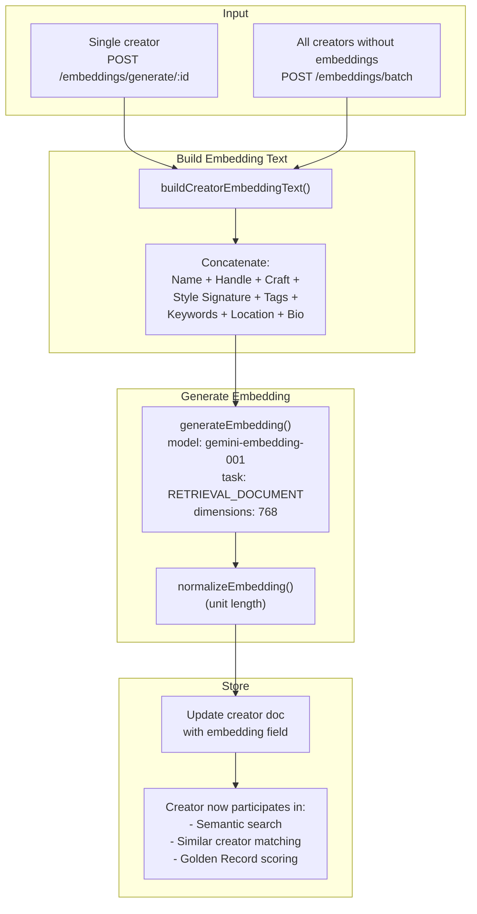

### How the Embedding Text is Built

The function `buildCreatorEmbeddingText()` combines multiple profile fields into a single text string for embedding:

```
Creator: Alex Chen. Handle: @alexchen_dp. Primary craft: cinematographer.
Secondary crafts: colorist, editor. Style: Moody, naturalistic cinematography
with a preference for handheld intimacy and available light. Technical
expertise: #ArriAlexa, #Anamorphic, #NaturalLight. Keywords: award winner,
Camerimage, staff pick. Location: Los Angeles.
```

This text is then embedded into a 768-dimensional vector using `gemini-embedding-001` with the `RETRIEVAL_DOCUMENT` task type (optimized for indexing documents that will be searched later).

### Batch Generation

`POST /api/v1/embeddings/batch` finds all creators in Firestore that lack an `embedding` field, builds their text, and generates embeddings in batch. This is typically run after a scraper import to index new creators.

---

## 5. Workflow 4: Golden Record Model

The Golden Record model represents the "ideal CatchFire creator." It is a centroid (average) of all Golden Record embeddings, used to find creators who match the CatchFire aesthetic.

### Flow Diagram

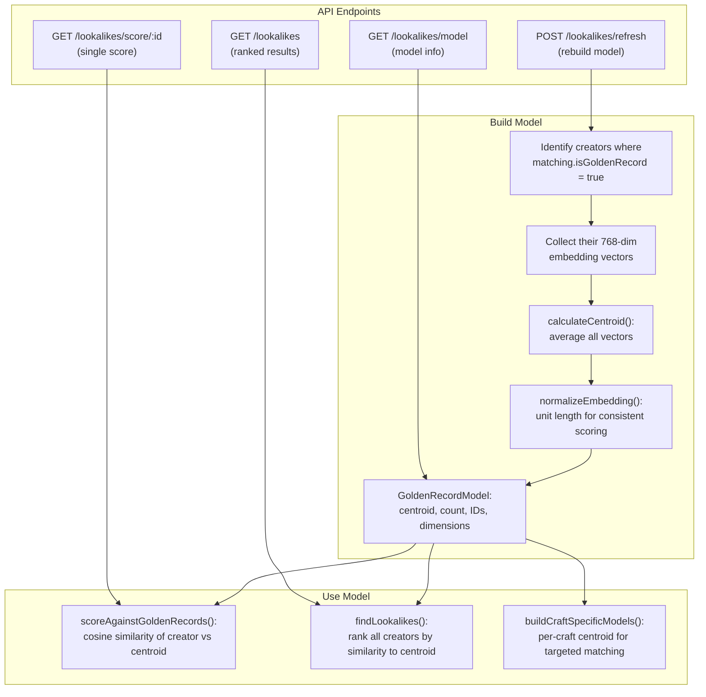

### How It Works

1. **Golden Records are hand-picked** by the CatchFire Creative team -- creators who represent the benchmark for what CatchFire looks for
2. Each Golden Record has `matching.isGoldenRecord = true` in Firestore
3. When the model is built (or refreshed), all Golden Record embeddings are averaged into a single centroid vector
4. Any creator can then be scored against this centroid using cosine similarity
5. `findLookalikes()` ranks all non-Golden-Record creators by their similarity to the centroid

### Use Cases

- **"Who else is like our best creators?"** -- Run `GET /api/v1/lookalikes` to find creators most similar to the Golden Record model
- **"How close is this new creator to our ideal?"** -- Run `GET /api/v1/lookalikes/score/:id` to get a 0-1 similarity score
- **Per-craft models** -- `buildCraftSpecificModels()` creates separate centroids for cinematographers, motion designers, etc.

> **Note:** The model is cached in memory and must be manually refreshed via `POST /api/v1/lookalikes/refresh` when new Golden Records are added. The Creative team is responsible for identifying and marking Golden Records.

---

## 6. Workflow 5: Brief Intake and Matching

This is the core workflow: a client brief goes in, ranked creator recommendations come out. There are two matching strategies that can work independently or together.

### Flow Diagram

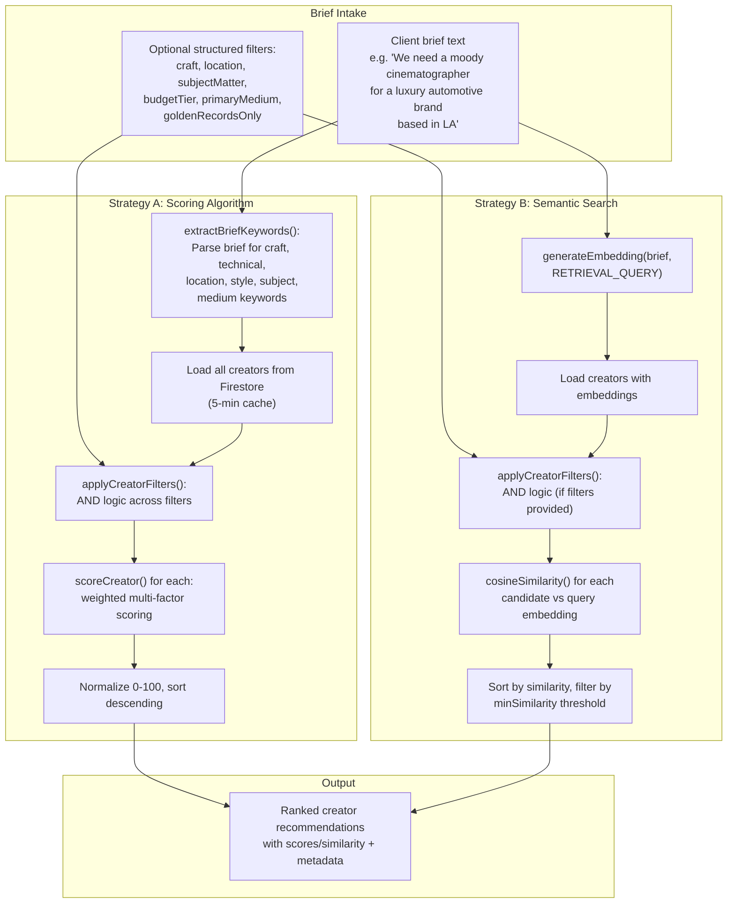

### Strategy A: Scoring Algorithm (`POST /api/v1/match`)

Best for: Structured matching where the brief mentions specific crafts, locations, equipment, or subject matter.

**Step-by-step:**

1. **Validate** the request body against `MatchRequestSchema` (Zod)
2. **Extract keywords** from the brief text using `extractBriefKeywords()`:
   - Craft keywords (cinematographer, editor, VFX...)
   - Technical keywords (ARRI, anamorphic, Houdini...)
   - Location keywords (LA, NYC, London...)
   - Style keywords (cinematic, moody, bold...)
   - Subject matter (food, automotive, fashion...)
   - Primary medium hint (still, video, audio)
3. **Load all creators** from Firestore (in-memory cache, 5-min TTL)
4. **Apply pre-filters** using `applyCreatorFilters()` (AND logic across all filter dimensions)
5. **Score each creator** using `scoreCreator()` with the weighted system:
   - Exact name match: 100 pts
   - Craft match: 30 pts (primary) / 15 pts (secondary)
   - Location match: 20 pts
   - Technical tag match: 10 pts each
   - Subject matter: 12 pts, subcategory: 8 pts
   - Primary medium: 10 pts
   - Golden Record bonus: 15 pts
   - Quality score factor: 0.2x
   - Penalties: negative keywords (-20 each), influencer noise (-10 each)
   - Bonuses: craft indicators (+5 each, max +20)
6. **Normalize** scores to 0-100 and **rank** descending
7. **Return** top N results with score breakdowns

### Strategy B: Semantic Search (`POST /api/v1/search/semantic`)

Best for: Natural language queries, exploratory searches, or when the brief is fuzzy and doesn't contain specific technical terms.

**Step-by-step:**

1. **Embed the query** using `generateEmbedding(brief, 'RETRIEVAL_QUERY')` -- the `RETRIEVAL_QUERY` task type optimizes the vector for searching against indexed documents
2. **Load all creators with embeddings** from Firestore
3. **Apply structured filters** (if provided) using `applyCreatorFilters()` to narrow candidates before similarity ranking
4. **Calculate cosine similarity** between the query embedding and each candidate's stored embedding
5. **Filter** by `minSimilarity` threshold (default 0.3)
6. **Return** top N results sorted by similarity score

### Multi-Chip AND Logic (Hint Chips)

The legacy dashboard supports combining multiple search dimensions:

1. **Query chips** (solid border) set the semantic search text: "Moody DP", "Motion Design", "VFX Artist"
2. **Filter chips** (dashed border) add structured AND-logic filters: subject matter (Food, Fashion), location (LA, NYC)
3. When both are active, the system:
   - Concatenates active query chips into the embedding query
   - Passes active filter chips as the `filters` object
   - Semantic search runs with both the embedding similarity ranking AND the structured pre-filter

### When to Use Which Strategy

| Scenario | Best Strategy | Why |
|----------|--------------|-----|
| "I need a cinematographer in LA with ARRI experience" | Scoring (Strategy A) | Specific craft, location, and equipment keywords |
| "Someone who can make food look cinematic and warm" | Semantic (Strategy B) | Fuzzy/aesthetic query, no specific technical terms |
| "Moody DP for automotive" | Both | Use hint chips: query chip for "Moody DP" + filter chip for "automotive" |
| "Who's similar to our Golden Record creators?" | Golden Record model | `GET /api/v1/lookalikes` |

---

## 7. Workflow 6: Result Delivery

Matched results reach end users through four channels. Each presents the same underlying data in a format appropriate for the channel.

### Flow Diagram

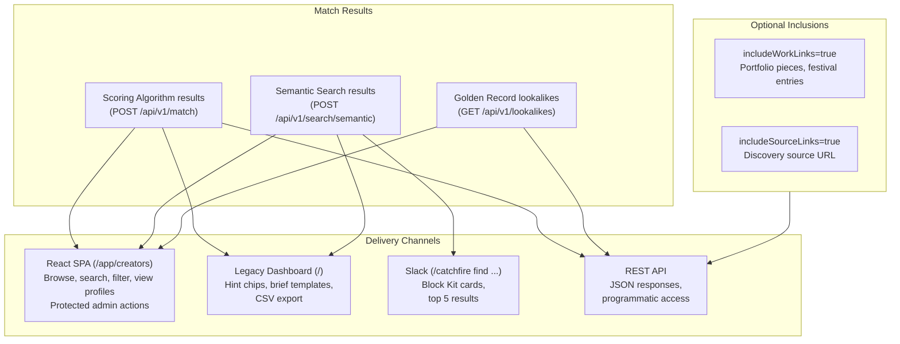

### Channel Details

#### React SPA (`/app/*`)

- **CreatorBrowse** (`/app/creators`): Search bar + filter chips for craft, platform, location. Paginated results.
- **CreatorProfile** (`/app/creators/:id`): Full creator detail with craft info, style signature, tags, contact, quality score.
- **Admin** (`/app/admin`): Protected route. Refresh lookalike model, admin actions.
- **Status** (`/app/status`): Health check dashboard showing all service statuses with response times.
- **Auth:** Token in `localStorage`, validated via `GET /api/v1/auth/me`. IAP auto-detected.

#### Legacy Dashboard (`/`)

- **Semantic search** with hint chips (query + filter chips, multi-select AND logic)
- **Brief templates** (10 pre-built queries across 5 categories: Fashion, Tech, Music, Branding, Film)
- **CSV export** of search results
- **Direct access** to all matching endpoints

#### Slack (`/catchfire find <query>`)

- Sends query through semantic search pipeline
- Returns Slack Block Kit formatted results (header + up to 5 creator cards)
- Each card shows: name, craft, location, similarity score, style signature
- Visible to all channel members (`response_type: 'in_channel'`)

#### REST API

- All endpoints return structured JSON with `{ success: boolean, ... }`
- Supports `includeWorkLinks` and `includeSourceLinks` params to include portfolio/source URLs
- Paginated where applicable (`limit` parameter)

---

## 8. Workflow 7: Feedback Loop

After receiving match results, the Creative team can provide quality feedback. This data flows back into the system to improve future matching.

### Flow Diagram

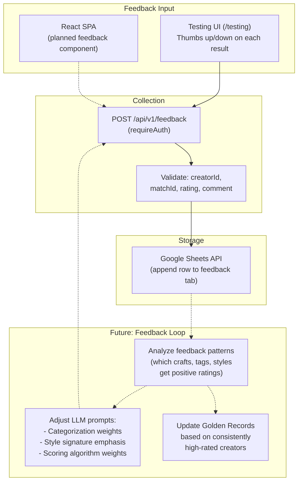

### Current State

1. **Testing UI** (`/testing`) has thumbs up/down buttons on match results
2. `POST /api/v1/feedback` validates the feedback and appends a row to a Google Sheet via the Sheets API
3. Sheet contains: creator ID, match query, rating (thumbs up/down), optional comment, timestamp

### Blocked

- `FEEDBACK_SHEET_ID` env var is not yet set -- **waiting on PM decision from Dan**
- Without the sheet ID, feedback is accepted by the API but has nowhere to write
- The "future" feedback loop (prompt tuning, Golden Record updates) depends on having enough feedback data to analyze patterns

---

## 9. Workflow 8: Admin and Operations

Day-to-day management of the system: monitoring, health checks, scraper oversight, and model maintenance.

### Flow Diagram

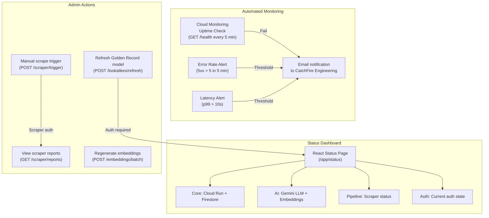

### Routine Operations

| Task | Frequency | How | Who |
|------|-----------|-----|-----|
| Check system health | On demand | Visit `/app/status` or `GET /health` | Engineering |
| Review scraper runs | After each cron cycle | `GET /api/v1/scraper/reports` or ScraperDashboard | Engineering |
| Refresh Golden Record model | After adding new Golden Records | `POST /api/v1/lookalikes/refresh` or Admin page | Creative team |
| Generate embeddings for new creators | After bulk imports | `POST /api/v1/embeddings/batch` | Engineering |
| Manual scraper run | As needed | `POST /api/v1/scraper/trigger` or ScraperDashboard | Engineering |
| Review monitoring alerts | On alert | Check email, then Cloud Console | Engineering |

### Troubleshooting Quick Reference

| Symptom | Likely Cause | Fix |
|---------|-------------|-----|
| `/health` returns error | Cloud Run service down | Check Cloud Run logs in GCP Console |
| Scraper runs show `status: failed` | Python subprocess error | Check `scraper_runs` error field, review Python logs |
| Semantic search returns no results | No embeddings generated | Run `POST /api/v1/embeddings/batch` |
| LLM test fails | API key expired or quota exceeded | Check `GEMINI_API_KEY`, verify GCP billing |
| Auth returns 401 in production | Token not in `API_AUTH_TOKENS` or IAP misconfigured | Verify env vars, check IAP config in GCP Console |
| Lookalike scores all very low | Too few or too diverse Golden Records | Review Golden Record selection with Creative team |

---

## 10. Workflow 9: Deployment and CI/CD

How code moves from a developer's machine to production.

### Flow Diagram

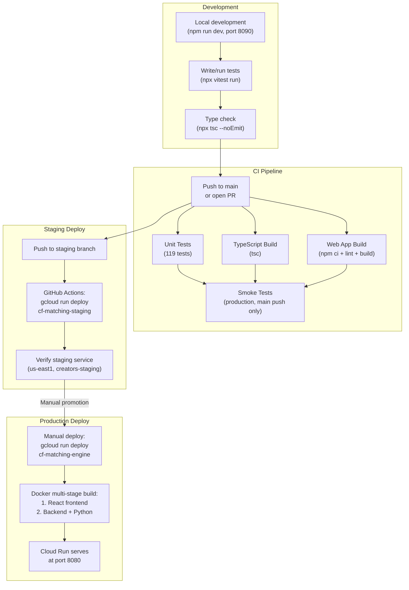

### Development -> CI

1. Developer works locally (`npm run dev` on port 8090)
2. Run tests (`npx vitest run`) and type check (`npx tsc --noEmit`)
3. Push to `main` branch or open a PR
4. GitHub Actions CI runs 4 parallel jobs: unit tests, TypeScript build, web app build + lint
5. If all pass and it's a push to `main`, smoke tests run against production

### Staging

1. Push to the `staging` branch
2. GitHub Actions deploys to `cf-matching-staging` in `us-east1`
3. Uses `creators-staging` Firestore collection (isolated from production data)
4. Verify at the staging URL before promoting to production

### Production

1. Manual deploy via `gcloud run deploy cf-matching-engine --source .`
2. Cloud Build creates a Docker image using the multi-stage Dockerfile:
   - Stage 1: Build React frontend (`web/dist`)
   - Stage 2: Install Node deps, compile TypeScript, install Python deps, copy everything
3. Cloud Run serves the container on port 8080 with `NODE_ENV=production`
4. IAP gates access; `--no-allow-unauthenticated` ensures no public access without SSO

---

## 11. How This Fits Into CatchFire

The Matching Engine is one piece of CatchFire's broader creative talent workflow. Here is how it connects to the larger organization.

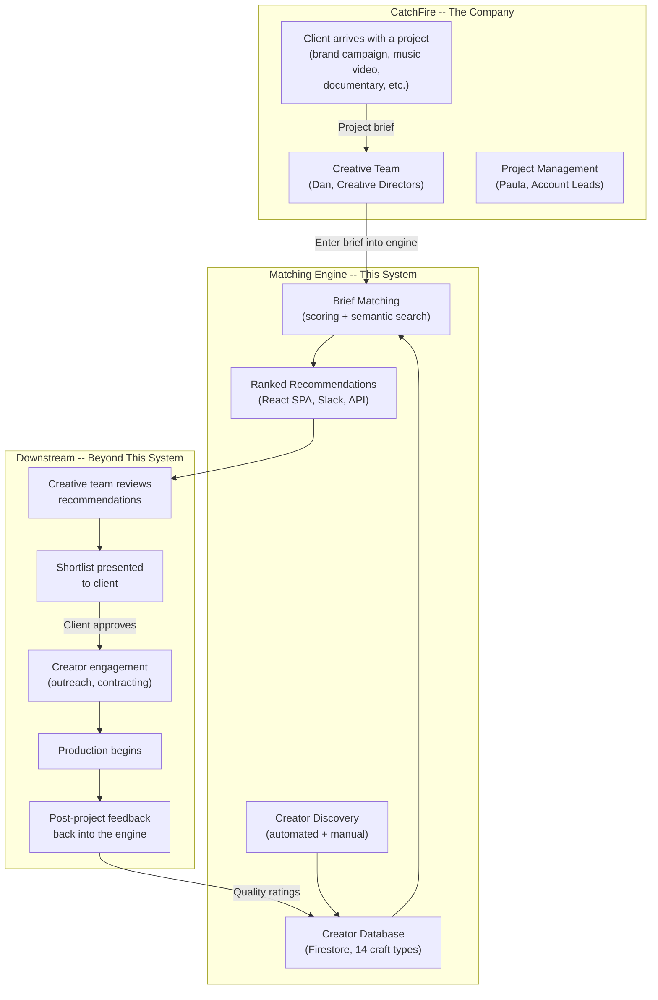

### The Big Picture

1. **A client comes to CatchFire** with a creative project need (e.g. "We're launching a luxury automotive brand and need a moody cinematographer")
2. **The Creative team translates this into a brief** and enters it into the Matching Engine (via the React SPA, legacy dashboard, or Slack)
3. **The engine searches its database** of pre-vetted creators using both algorithmic scoring and semantic similarity
4. **Ranked recommendations** are returned with scores, style signatures, and craft details
5. **The Creative team reviews** the recommendations, potentially adjusting filters or trying different query phrasings
6. **A shortlist is presented to the client** with creator profiles, portfolio links, and CatchFire's recommendation rationale
7. **The client selects creators**, and CatchFire manages the engagement (outreach, contracting, production)
8. **After the project**, quality feedback flows back into the engine to improve future matching

### What's Inside vs Outside This System

| Inside the Matching Engine | Outside (CatchFire Org) |
|---------------------------|------------------------|
| Creator discovery and scraping | Client relationship management |
| LLM categorization and enrichment | Contract negotiation |
| Embedding generation and indexing | Production management |
| Brief analysis and matching | Budget and billing |
| Result ranking and delivery | Client presentation |
| Feedback collection | Creator outreach |
| System monitoring | Long-term talent relationships |

### Open Questions

These questions affect how the Matching Engine evolves to better serve CatchFire's needs:

| Question | Impact | Owner |
|----------|--------|-------|
| Should the engine handle creator outreach (email templates, CRM)? | Extends scope into engagement | Dan / Creative |
| Should match results include budget estimates? | Requires rate data from creators | Paula / Account |
| Should there be a client-facing view (not just internal)? | New frontend or API integration | Product decision |
| How do Golden Records get selected -- formal criteria or Creative intuition? | Affects model quality | Dan / Creative |
| Should the feedback loop auto-adjust scoring weights? | ML pipeline complexity | Engineering |

---

## 12. Workflow Status Summary

| Workflow | Status | Key Dependencies |
|----------|--------|-----------------|
| WF1: Creator Discovery | **Live** (automated scraper + manual entry) | Cloud Scheduler, Python, Firestore |
| WF2: Enrichment | **Live** (categorization, style, vision); **Scaffolded** (contact enrichment) | Gemini Flash, Gemini Vision |
| WF3: Embedding Generation | **Live** | gemini-embedding-001, Firestore |
| WF4: Golden Record Model | **Live** | Golden Records in Firestore, manual refresh |
| WF5: Brief Matching | **Live** (both strategies) | Scoring algorithm, embeddings, Firestore |
| WF6: Result Delivery | **Live** (React, Legacy, API); **Scaffolded** (Slack) | Express, React SPA, Slack app registration |
| WF7: Feedback Loop | **Scaffolded** (collection); **Planned** (prompt tuning) | `FEEDBACK_SHEET_ID` from Dan |
| WF8: Admin and Operations | **Live** | Cloud Monitoring, Status page |
| WF9: Deployment and CI/CD | **Live** | GitHub Actions, Docker, Cloud Run |

---

Author: Charley Scholz, JLAI
Co-authored: Claude Opus 4.6, Claude Code (coding assistant), Cursor (IDE)
Last Updated: 2026-03-05
